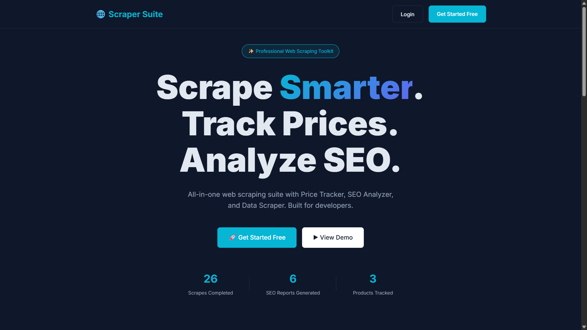
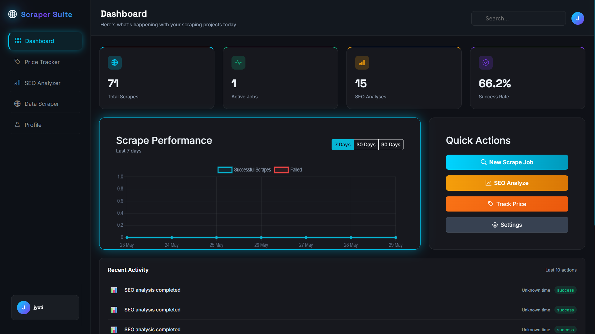
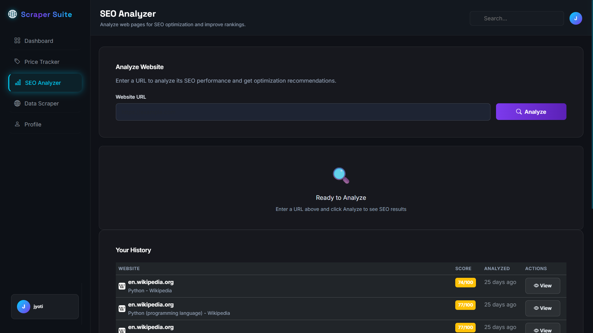
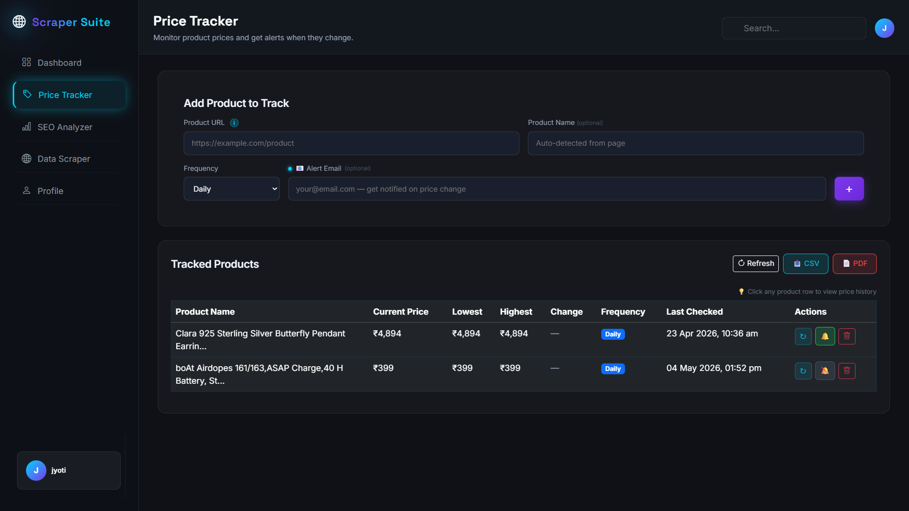

---

<div align="center">

# 🌐 Scraper Suite


### A full-stack web scraping toolkit built with Python & Flask

[🎥 Demo Video](https://www.loom.com/share/4ce12fe3380042cf9716757750266efc)

</div>

---

## 📸 Screenshots

| Landing Page | Dashboard |
|-------------|-----------|
|  |  |

| SEO Analyzer | Price Tracker |
|-------------|--------------|
|  |  |
---

## ✨ Features

### 🔍 SEO Analyzer
- Analyze any website's SEO score (0-100)
- Check meta tags, headings, keyword density
- Internal/external link analysis
- Actionable improvement recommendations
- Full history of past analyses

### 💰 Price Tracker
- Track product prices on Flipkart & Amazon
- Auto price detection using web scraping
- Lowest/Highest price history tracking
- Email alerts on price drops
- Export reports as CSV and PDF
- Hourly/Daily/Weekly monitoring

### 🌐 Data Scraper
- Extract text, headings, links from any website
- Support for JS-heavy sites via Playwright
- Export scraped data as JSON and CSV
- Full history of scraping jobs

### 📊 Live Dashboard
- Real-time stats (scrapes, SEO analyses, products)
- Scrape performance chart (7/30/90 days)
- Recent activity timeline
- Quick action shortcuts

### 👤 User System
- Secure register and login
- Profile page with usage stats
- Password change
- Export data anytime

---

## 🛠️ Tech Stack

| Category | Technology |
|----------|-----------|
| Backend | Python 3.8+, Flask |
| Database | SQLite |
| Scraping | BeautifulSoup4, Requests, Playwright |
| Frontend | HTML5, CSS3, JavaScript |
| Charts | Chart.js |
| PDF Export | ReportLab |
| Auth | Flask-Session |

---

## 🚀 Getting Started

### Prerequisites
- Python 3.8+
- pip

### Installation

**1. Clone the repository**
```bash
git clone https://github.com/YOUR_USERNAME/scraper-suite.git
cd scraper-suite
```

**2. Install dependencies**
```bash
pip install -r requirements.txt
```

**3. Install Playwright browser**
```bash
playwright install chromium
```

**4. Run the application**
```bash
python app.py
```

**5. Open in browser**
```bash
Open your browser and go to: http://localhost:5000
```

## 📁 Project Structure
```bash
scraper-suite/
├── app.py                 # Main Flask application
├── auth.py                # Authentication routes
├── database.py            # Database initialization
├── requirements.txt       # Python dependencies
├── blueprints/
│   ├── price_tracker.py
│   ├── seo_analyzer.py
│   └── data_scraper.py
├── templates/
│   ├── landing.html
│   ├── dashboard.html
│   ├── login.html
│   ├── register.html
│   ├── price_tracker.html
│   ├── seo_analyzer.html
│   ├── data_scraper.html
│   └── profile.html
└── data/
└── scraper_suite.db
```

---

## 📊 Project Status

| Module | Status |
|--------|--------|
| Landing Page | ✅ Complete |
| Authentication | ✅ Complete |
| Dashboard | ✅ Complete |
| SEO Analyzer | ✅ Complete |
| Data Scraper | ✅ Complete |
| Price Tracker | ✅ Working |
| Profile Page | ✅ Complete |
| Export CSV/PDF | ✅ Complete |

---

## ⚠️ Disclaimer

This tool is for educational and 
legitimate use only. Always comply 
with website terms of service.

---

## 👩‍💻 Author

**Your Real Name**
- 🔗 LinkedIn: [Your LinkedIn URL]
- 🐙 GitHub: [Your GitHub URL]

---

## 📝 License

MIT License — free to use and modify.

---

<div align="center">

**⭐ If this project helped you, please give it a star!**

Made with ❤️ using Python & Flask

</div>
